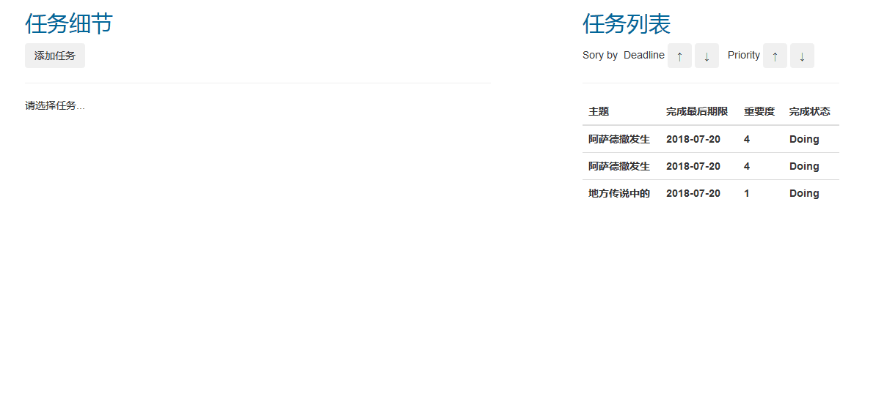

## 截图
- 添加任务

- 完成和删除

- 编辑

- 排序

##使用
- `cd backend`
- `sudo pip install -r requirements.txt`
- `sudo python manage.py migrate auth`
- `sudo python manage.py migrate`
- `sudo python manage.py runserver`
- (use `sudo python manage.py createsuperuser` to create your own superuser)
- Open the other Terminal
- `cd frontend`
- `sudo npm run start`
